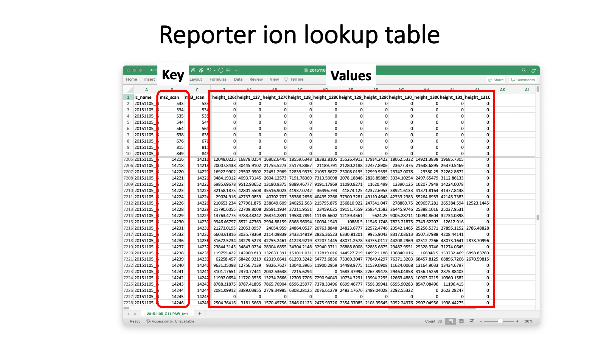
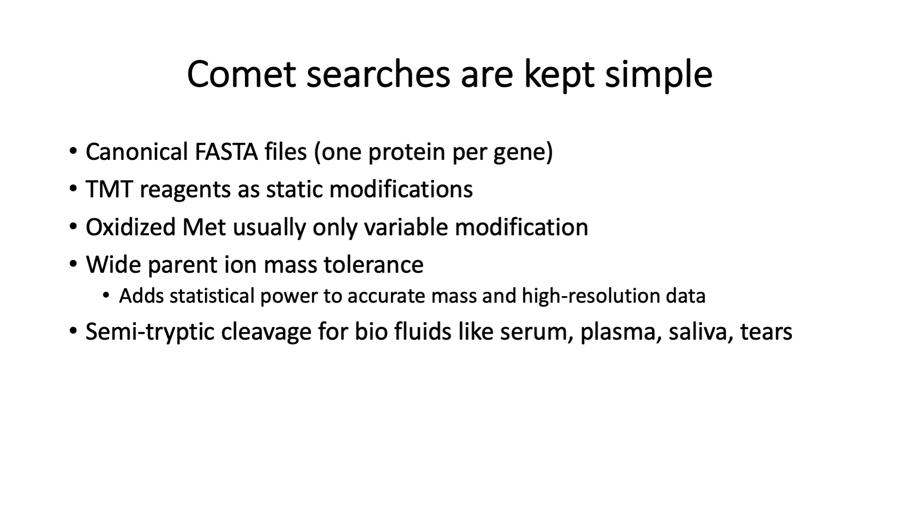
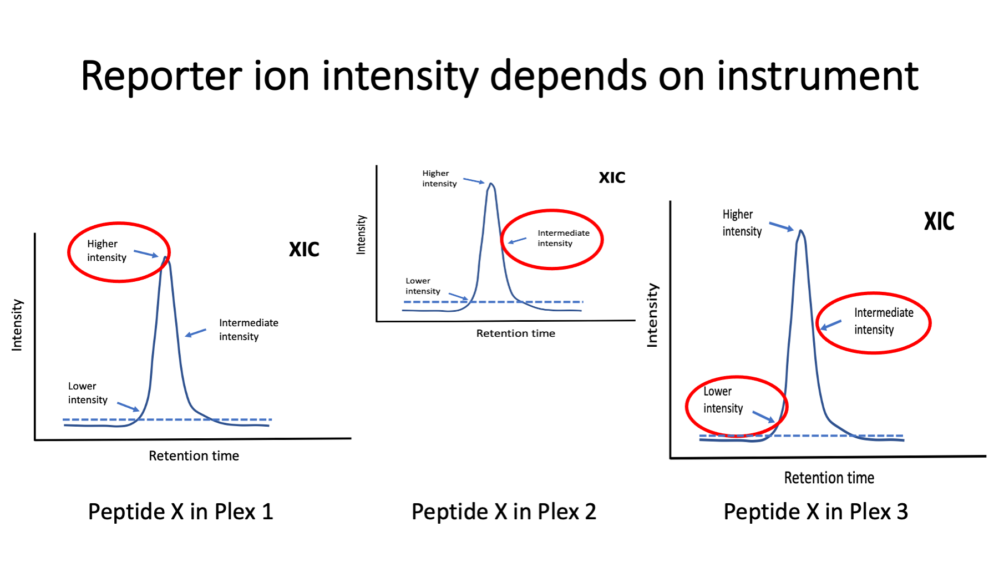
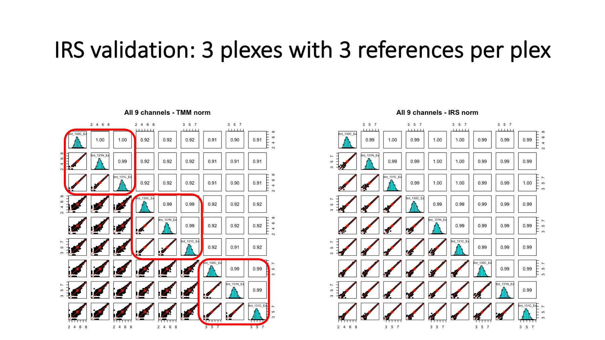
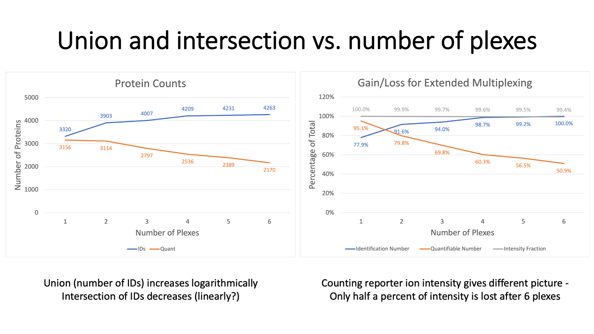

# TMT_PAW_pipeline
Details about how TMT labeling is handled in PAW pipeline

---

This presentation details how TMT data are processed in the PAW pipeline.

---

These steps are the same for single or multiple-plex experiments.

---

Language matters in science. Here are some terms related to TMT labeling. Many of these terms can have multiple meanings depending on context or have ambiguous meanings. Replicates can be technical replicates of biological replicates. Sometimes runs can be samples (single shot experiments). Experiments can be studies (biological experiments) or mass spec experiments. I use the term plex to bridge the gap between samples and experiments. As studies have gotten larger (more biological replicates), having a term for the intermediate data that constitute an experiment is needed.

---

The PAW pipeline (https://github.com/pwilmart/PAW_pipeline) is a series of Python scripts. Two freely available programs are used: msconvert from the Proteowizard toolkit (https://proteowizard.sourceforge.io) is used to convert the Thermo RAW files into text files. The Comet search engine (https://uwpr.github.io/Comet/) is used to assign peptide sequences to fragment ion spectra (MS2 scans). All other steps were developed at OHSU.

---

The TMT reporter ion peak heights are extracted during data conversions (the first step). The PAW pipeline does not do any correction factors for label reagent isotopic purity (see https://pwilmart.github.io/blog/2022/08/20/TMT-channel-crosstalk for a deeper dive on the topic). The peak heights are summarized into peptide and protein intensity totals **only** after proteins have been inferred (one of the last steps). The reporter ion channel intensity columns get added to the top-hit summary files (and are retained in the filtered top-hit summary files). MS2 scan sequence assignments are not trivially related to the final list of inferred proteins, so it is not trivial to directly aggregate PSM quantitative data to higher levels. In other words, propagating quantitative data through the pipeline (from top to bottom in the diagram) is not done.

---

The binary RAW files logged by the instrument contain the actual data from the survey scans (the precursor ions, a.k.a. MS1 scans) and any dependent scans. Dependent scans depend on information from higher level scans. The precursor ion m/z values and intensities are used to select ions for fragmentation in MS2 scans. The peaks in the MS2 scans are used to generate the reporter ion data in the SPS-MS3 scans. Data from mass spectrometers is mostly m/z values and associated ion currents. With high resolution instruments, we have sparse data vectors/matrices. The instrument operates on a scan cycle mode where the MS1 scans define the cycles. The dependent scans occur within each cycle (no longer technically true with intelligent data acquisition methods).

Manufacturers do not provide RAW file specs but do provide APIs for data reading. Tools like msconvert can extract scan-level data from RAW files and write it in more accessible formats. The reporter ion MS3 scans are acquired in profile mode but typically centroided during conversions. The resolutions for scans (50K to 60K) baseline resolve the N- and C-forms of the tags. MS2 scans use the linear ion trap. The MS3 scans use the Orbitrap. The two analyzers operate independently (ion trap is fast, Orbitrap is slow). Data logging from the scans are interleaved and the pattern of scans within each cycle can vary. The MS2 scan data is written into MS2-format text files for use by Comet. The MS3 scan data is parsed to extract the reporter ion peak heights (intensities) and store the peak heights keyed by MS2 scan number. The peak heights are the maximum intensity value in narrow windows centered on the theoretical reporter ion masses. For any PSM with an associated MS2 scan number, reporter ion data can be retrieved.

---

This is what the reporter ion lookup tables have in them. A table is written for each RAW file. The LC file name could be derived from the lookup table filename and is probably redundant. The MS2 scan number is the key. The set of reporter ion peak heights are the values. We have a range of peak height values (about 4 orders of magnitude) including zeros. Thermo Orbitraps have an FT transient noise baseline subtracted and the intensity values do not linearly go to zero. On the Fusion, we see heights that go down to about 300 then to zero. Scans without usable reporter ion peak heights can still produce confident peptide sequence assignments for protein inference. We do not want to filter out any PSMs based on quantitative data quality. If we do that, we do not get as correct a final list of inferred proteins.

---

Although the reporter ion data is not really used until after protein inference, it is added to the top-hit summary files created after the Comet searches. The top-hit summaries have basic peptide identification information (peptide sequences, protein accessions, measured and calculated masses, and Comet match scores). The PAW pipeline adds a discriminant function score, tallies number of enzymatic termini, and whether that match was to target or decoy proteins. The top-hit files before PSM FDR analysis have reporter ion data for every MS2 scan. After PSM FDR analysis, row-filtered top-hit files are written that retain the reporter ion data. Full transparency of quantitative data is provided for rejected PSMs, accepted PSMs, PSMs associated with inferred proteins, and PSMs not mapped to the final proteins.

---

The choice of FASTA file is critical in bottom-up proteomics, and discussed in https://pwilmart.github.io/blog/2020/09/19/shotgun-quantification-part2. Controlling false discovery rates in bottom-up proteomics experiments is also challenging. We keep Comet searches as simple as possible while capturing sufficient quantitative data for reliable analysis. We do not configure Comet to identify everything in the samples. We try to capture most of the signal, though.

---

The PAW pipeline is well documented at GitHub (https://github.com/pwilmart/PAW_pipeline). It uses the target/decoy method for PSM FDR estimation. A PeptideProphet discriminant function is used to better distinguish correct matches from incorrect matches. Subclassing peptides and doing independent FDR control makes the FDR analysis adaptive to the data. You can read more about some of the unique aspects of the PAW pipeline at https://pwilmart.github.io/blog/2021/06/06/PAW-pipeline-backstory.

---

The datasets in these experiments are large. The ID rate (fraction of scans with a confident peptide sequence assignment) is typically 20% to 40% in real experiments. New data files are created for the PSMs that pass the FDR cutoff to speed up downstream processing (and simplify coding). The filtered top-hit files have all the information for protein inference. Protein inference is basically grouping peptides by protein, masking I and L residues, and doing peptide set comparisons. Identical peptide sets are lumped together into protein groups. Peptide sets that are formal subsets of other peptide sets have their proteins removed from the inferred lists (this is the parsimony part). We require two independent peptide matches to proteins to eliminate noisy, low abundance proteins. The PAW pipeline has an extended grouping algorithm to combine highly homologous proteins (nearly identical peptide sets) into protein families.

NOTE: quantitative data is not considered during protein inference. All PSMs, even those without usable quant data, are needed for the best protein inference.

---

This question is at the heart and soul of bottom-up quantitative proteomics. I have written a couple of blog posts about the topic: https://pwilmart.github.io/blog/2019/09/21/shotgun-quantification and https://pwilmart.github.io/blog/2020/09/19/shotgun-quantification-part2.

In principle, any peptide can provide the data for protein quant. The lower-level data is noisier and combining PSM data into protein summaries can result in better data. Not all peptides have a one-to-one relationship with their parent proteins. Some peptides can originate from more than one protein and would have mixed quantitative data. We need to define peptides with one-to-one relationships (unique peptides) from those with mixed relationships (shared peptides). Defining shared and unique depends on the protein inference results. Only after we have a final list of proteins, protein groups, and protein families can we define which peptides are unique and shared. The different contexts mentioned above can have small effects on the final results or very profound effects. It depends on many factors, such as, the FASTA file peptide redundancy, and the sample proteins and how similar their sequences might be.

---

To see how data quality improves by aggregating PSMs, we have data where a mouse brain membrane sample was allocated to TMT channels (before labeling) in a dilution series. See https://pwilmart.github.io/TMT_analysis_examples/MAN1353_peptides_proteins.html for more details. The different protein amounts are color coded. PSM data on the left has a lot of scatter. The 60K PSMs map to about 20K peptides (center) and the peptide-level data has reduced scatter. The largest reduction in scatter is at the protein level (about 2.7K proteins) on the right.

---

There are PSM aggregations choices. I use summation of the reporter ion peak heights from all PSMs associated with **unique** peptides for each protein. Summing is similar to weighted averaging because more intense reporter ions contribute more to the total. There is missing data in TMT experiments (but far less than other quant methods) and what to do about missing data is an evergreen question (https://pwilmart.github.io/blog/2018/12/12/TMT-zero-replacement is a blog post from 2018). The instrument gets ragged on the low end, so a trimmed average reporter ion intensity test is used. The highest and lowest intensity are removed, the remaining channels averaged and tested against a user specified value (typically 500). If a PSMs set of reporter ions fail the test, they are all set to zero (so they do not contribute to protein totals). Combining multiple PSMs into protein values potentially removes many missing values at the PSM level. We will have a more reasonable pattern of missing values at the protein level. We usually use a sentinel value of 150 for any protein channel zero replacements. We will have a few proteins that we identify without any associated quant data. Quant is a subset of ID.

---

During protein inference, the LC runs have to be assigned to “samples”. Individual runs are samples in single shot experiments. In experiments with fractionation, sets of LC runs come from one sample. In TMT experiments, the samples associated with TMT channels are hidden from the protein inference algorithm. Each fractionated TMT plex in a multiple-plex experiment is effectively a “sample” as far as the protein inference step is concerned. After protein inference and protein grouping, we have a table of identified proteins, protein groups, or protein families. There is a higher-level peptide summary file that lists the peptides for each protein and the “samples” they were seen in. There is also information in this file about the shared or unique status of each peptide with respect to the final list of proteins. For each ”sample”, there are more complete lists of peptides that include some PSM-level information and have the MS2 scan numbers for the PSMs. The “add_TMT_intensities.py” script uses this information along with the reporter ion intensities for each MS2 scan number in each LC run to compute the total reporter ion values for each protein. Pseudo code is shown in the slide.

---

These details are for multiple-plex TMT experiments.

> Plubell DL, Wilmarth PA, Zhao Y, Fenton AM, Minnier J, Reddy AP, Klimek J, Yang X, David LL, Pamir N. Extended Multiplexing of Tandem Mass Tags (TMT) Labeling Reveals Age and High Fat Diet Specific Proteome Changes in Mouse Epididymal Adipose Tissue. Mol Cell Proteomics. 2017 May;16(5):873-890. doi: 10.1074/mcp.M116.065524. Epub 2017 Mar 21. PMID: 28325852; PMCID: PMC5417827.

---

The PAW pipeline is flexible, so there are options for how to process data from multiple experiments. They can be processed in chunks, or all data analyzed in one go. Comet search parameters should be the same for data processed in chunks. Any data to be combined across multiple plexes needs to have a combined protein inference done. If we process the data in chunks, we can copy all the filtered top-hit files into a single folder and run the protein inference script. We need unified quantitative data per protein, and this is the safest way to do that.

---

A typical grouped protein summary file would have the data in the grey columns. The quantitative summary script add the reporter ion intensities totals for each TMT experiment (plex). The example here has three plexes.

---

Single factor data scalings do not work for TMT data from multiple plexes (see https://pwilmart.github.io/TMT_analysis_examples/IRS_validation.html). The MS2 scans are dynamically selected in real time by the instrument (next slide) and the selection resembles a pseudo random sampling. Because reporter ions are measured together in a single scan, and aggregation within a TMT plex preserves this pattern, each plex will have a unique pattern of reporter ion intensities. Individual channels from TMT plexes will cluster together, each plex will a distinct cluster, and the clustering pattern will resemble typical batch effects. In fact, given a well-balanced study design, some batch correction methods can work with TMT data. IRS was designed to put a common yardstick into each plex so that the measurement scales could be figured out and adjusted to be the same without any balanced study design constraints. This preserves the natural reporter ion peak height measurement scale between plexes and extends the number of samples that can be simultaneously measured. This avoids transformations to ratios and their associated limitations.

---

Image a specific peptide eluting from the column in the same fraction in three different TMT experiments. The instrument may be performing better or worse at each of the three times. The dynamic way the instrument selects scans is the biggest variable factor. A chromatography peak may be sampled for peptide fragmentation at any time it gets above a minimum intensity (dotted lines). The samplings can be near the top of the peak, near the leading or trailing edges of the peak, or somewhere in between. The reporter ion intensities depend on the analyte’s relative abundance (higher near the peak and lower near the baseline). TMT labeling can accommodate more complicated liquid chromatography than many other types of quantitation. Peptides may be present in more than one charge state and in more than one LC run. Modified peptide forms also cause multiple peaks. Samples with extensive modifications can complicate TMT labeling analyses. Protein summarization and reference channels allows more freedom from analytic platform variability. IRS does not require the same sets of peptides for proteins in each of the plexes. If there are measured reporter ions for the reference channel protein in all plexes, the protein abundance estimates can be matched across plexes.

---

The IRS design is straight forward. Now that we have 18 channels, constructing balanced plexes would be easier and plex average could substitute for reference channels. IRS was developed when we had 10-plex kits. It helps to have the reference channels be as identical as possible. The best strategy is to pool aliquots of protein from all samples being labeled. Aliquots of that pooled mixture can be digested, and the peptide digests pooled. Aliquots of the pooled peptide digests can serve as the identical reference channels. The pooled protein mixture does not have to include protein from all samples in an experiment (something that may be difficult in larger studies). However, it should be a mixture of representative samples (the more samples the better).

Averages of the two reference channels in each plex determines the local measurement scale. The IRS factors per protein put the local scales onto a common global scale. The IRS factors are used to scale all channels in each plex (biological samples in addition to the reference channels) collectively. IRS scaling is done independently for each quantifiable protein in the experiment. The [publication below](https://www.ncbi.nlm.nih.gov/pmc/articles/PMC5417827/pdf/zjw873.pdf) was where IRS was first presented.

> Plubell DL, Wilmarth PA, Zhao Y, Fenton AM, Minnier J, Reddy AP, Klimek J, Yang X, David LL, Pamir N. Extended Multiplexing of Tandem Mass Tags (TMT) Labeling Reveals Age and High Fat Diet Specific Proteome Changes in Mouse Epididymal Adipose Tissue. Mol Cell Proteomics. 2017 May;16(5):873-890. doi: 10.1074/mcp.M116.065524. Epub 2017 Mar 21. PMID: 28325852; PMCID: PMC5417827.

---

The pandas Python script that performs IRS adjustments reads an annotated protein summary file from the PAW pipeline (where TMT intensities have been added). This is usually the summary file after the extended protein grouping, but it can also be the protein file after basic parsimony analysis. The annotations address two issues. One is that which protein are considered contaminants depends on the samples and cannot be reliable done in a fully automated way. Knowledge of the samples and the biological questions need to be used to decide contaminants. Any proteins that have any text in the cells in the Filter column are excluded from quantification (common contaminants, additional contaminants, decoys, etc.). Some of these labels are already specified (matches from the common contaminants FASTA collection and decoy sequences are taken care of). Some samples that folks study may contain blood proteins or keratins (two classes of proteins frequently in common contaminants databases). There may need to be editing of the text in the Filter column (either adding additional contaminant proteins or maybe clearing the text so that proteins will be quantified). Rows (proteins) with any text in cells in the Filter column will be moved to the bottom of the IRS-adjusted results table. Any blank cells in the Filter column denote quantifiable proteins.

The other thing the IRS scrip needs to know is what channels are the reference channels in each plex. Rather than use a separate sample key file, the sample names are added in Row 4 above their corresponding TMT channels. There is flexibility in naming the reference channels. The specified sample names are converted to upper case and the substring “POOL” is searched for in each block of TMT columns for each plex. Reference channels can have substrings such as “pool”, “pooled”, “Pool”, “POOL”, etc. If there were any unused channels in any plexes, those can be excluded from some data normalization computations by putting the substring “unused” (case insensitive) in the sample name. Technically speaking, only the identity of the reference channels are needed for data processing by the IRS script. However, properly naming the channels in Row 4 results in those names being used as column labels in the IRS script output table.

The protein summary files from PAW are tab-delimited text files. Those can be opened in Excel, appropriately annotated, and saved as tab-delimited text files. Excel has column filters and search functions that are particularly handy. I usually add “labeled_” as a file name prefix and save the annotated table as a new file.

---

The pandas Python script that performs IRS adjustments does the IRS adjustments and a few other data housekeeping tasks. Any proteins that have any text in the cells in the Filter column are excluded from quantification (common contaminants, additional contaminants, decoys, etc.). Rows (proteins) with any text in cells in the Filter column will be moved to the bottom of the results table. Any blank cells in the Filter column denote quantifiable proteins. Some of the typical proteomics columns are retained at the left of the results table (shown in grey above). The unaltered TMT intensity data by plex are the next blocks of columns (shown in light gold, blue, and green). The grand total intensities of each plexes’s channels are used to compute an experiment-wide target intensity total and a global scaling factor is applied to get all channels onto a common total intensity scale. This is called a “sample loading” (SL) adjustment (orange data columns). The SL-adjustment is only applied to quantifiable proteins. There will be lower abundance proteins that have data missing by TMT plex (the yellow highlighted cells [the middle bock above should have yellow bands that cover all channels – the last channel is incorrectly colored orange]). Averages of the reference channels in each plex are used to compute the IRS scaling factors for each protein in each plex. The right-most columns are the final IRS-adjusted columns. The table is sorted by decreasing experiment-wide average total reporter ion intensity and then blocked by number of plexes with missing data (red bands). The darker green rows have no missing data by plex. Then data is blocked by protein where data was missing in one of the three plexes. Next are the proteins where data was missing in any 2 of the 3 plexes. Non-missing data in these proteins gets IRS adjusted using the plexes whare it was seen. We do not end up a perfect, continuous common intensity scale for all proteins as a function of missingness. Each collection of rows that have data in the same plexes are locally on a common intensity scale after IRS. However, the SL-adjustment gets these different scales into reasonable alignment.

The results table written by the IRS script is large but well organized and has consistent column labels. It is an easy table to read into R analysis scripts.

---

This is some data from a larger study (nine 10-plexes) where two reference channels were used per plex. There were three unused channels experiment-wide, and an extra reference channel was added to three of the plexes. On the left, are the reference channels before IRS. We see that the 3 reference channels within each plex are highly similar (very tight scatter plots - highlighted in red rectangles). These identical channels are not very identical between plexes, however. We have scatter plots indicating high variability – too high for good statistical testing. On the right, we have the reference channel intensities after IRS adjustment. We see that all reference channels are nearly identical as expected.

---

We had three plexes where we had an extra reference channel. We did IRS using the other two channels and then used the third reference channel like a canary in a coal mine. This is a proper validation of IRS because these reference channels were not used to compute the IRS scaling factors. Note that lower abundance proteins have increase variance, a common feature in most quantitative proteomics data.

---

IRS does not allow unlimited plexing. There is a cost associated with the IRS concept. We typically restrict quantification in IRS experiments to the proteins present in all plexes. It is possible (untested assertion) to extend statistical testing to proteins with data missing by plex, but this is not a trivial exercise. The requirement of protein present in all plexes creates a union versus intersection challenge. The total number of proteins identified in a multi-plex experiment end up being the union of protein identifications in each plex. That grows logarithmically and maxes out after some number of plexes. The intersection depends on instrument performance within each plex and how consistently low abundance proteins have peptides that are sampled by the instrument. There are always some proteins only detected in one plex. We can expect a roughly linear decrease in the intersection of the identifications as a function of the number of plexes.

On the left, we see that protein IDs increase from about 3300 to 4300 for the six plexes. In contrast the number of proteins seen in all plexes drops from 3100 to 2100. We have about 50% of the identified proteins being quantifiable in this 6-plex example. Why use IRS if we lose so many proteins? Well, it depends on how you count things. We are measuring reporter ion intensities, so we can tally intensity instead of protein numbers. On the right, the top curve in grey is the fraction of the total reporter ion intensity associated with the intersection protein set as a function of number of plexes. After 6 plexes, the 2170 proteins still account for 99.4% of the total intensity.

---

No method in quantitative proteomics is perfect. That is true at all levels. To label or not to label, to fractionate or not fractionate, measure reporter ions in MS2 scans or in MS3 scans, one plex or more than one plex, etc. There are strengths and weaknesses for every choice at every step. IRS is kind of amazing, to be honest. It fixes one specific source of data distortion, and it fixes it very well. The main downside is the sense of loss as the union of protein IDs diverges from the quantifiable intersection. This despair can be alleviated by considering how much intensity (protein amount) you can quantify rather than number of proteins that can be quantified. The reference channel pairs also provide some much-needed quality control in these experiments.

I do not think of the PAW pipeline as a TMT "best practices" pipeline. It is more a pipeline that avoids most [**TMT bad practices**](https://pwilmart.github.io/blog/2021/12/17/TMT-bad-practices). I hope this presentation has shed some light on what TMT data processing entails and can help you make better use of whatever TMT analysis software you prefer.

---

Phillip Wilmarth   PSR Core, OHSU   October 14, 2022
